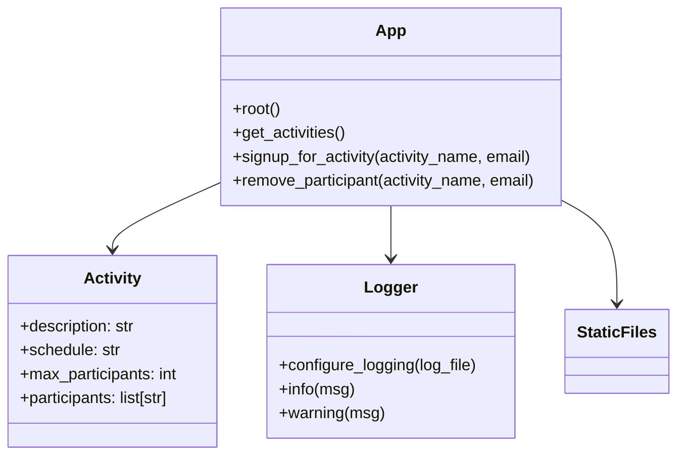

# Documentação do Projeto

## 1. Visão Geral

Este projeto é uma aplicação web simples para gerenciamento de atividades extracurriculares em uma escola fictícia. A aplicação oferece:

- API backend em FastAPI para listar atividades, inscrever participantes e remover participantes.
- Frontend estático carregado a partir de `src/static` para exibir atividades e permitir inscrições.
- Armazenamento em memória das atividades e participantes.
- Registro de logs no console e em arquivo.

## 2. Estrutura de Diretórios

```
/ (raiz)
  ├── DOCUMENTACAO.md          # Documentação do projeto
  ├── README.md               # Descrição do exercício
  ├── requirements.txt        # Dependências do Python
  ├── pytest.ini              # Configuração do pytest
  ├── src/
  │   ├── app.py              # Aplicação FastAPI e regras de negócio
  │   └── static/
  │       ├── index.html      # Interface do usuário
  │       ├── app.js          # Lógica de frontend e paginação
  │       └── styles.css      # Estilos visuais
  └── tests/
      ├── test_app.py         # Testes backend FastAPI
      ├── test_ui.py          # Testes de interface estática
      └── test_logs.py        # Testes de logging
```

## 3. Componentes do Backend

### `src/app.py`

Responsável por:

- Criar a instância do FastAPI.
- Montar os arquivos estáticos com `StaticFiles` na rota `/static`.
- Definir a base de dados em memória para atividades.
- Configurar logging para console e arquivo com `configure_logging()`.
- Definir endpoints da API.

### Dados em memória

A variável `activities` contém um dicionário de atividades. Cada atividade tem:

- `description`: descrição da atividade.
- `schedule`: horário da atividade.
- `max_participants`: limite teórico de participantes.
- `participants`: lista de emails dos inscritos.

## 4. Componentes do Frontend

### `src/static/index.html`

Página principal da interface do usuário.

- Exibe a lista de atividades carregadas pela API.
- Contém o formulário de inscrição com campos para email e seleção de atividade.
- Mostra mensagens de sucesso ou erro.

### `src/static/app.js`

Responsável por:

- Buscar a lista de atividades em `GET /activities`.
- Renderizar cartões de atividades com informações e lista de participantes.
- Adicionar paginação de 5 em 5 modalidades.
- Enviar requisições `POST` para inscrição e `DELETE` para remoção de participantes.
- Atualizar a interface dinamicamente sem recarregar a página.

### `src/static/styles.css`

Define o estilo da página:

- layout responsivo.
- cartões de atividade.
- formulário de inscrição.
- lista de participantes sem bullets.
- botões de paginação e remoção.

## 5. Diagramas

### 5.1 Diagrama de Casos de Uso

```mermaid
usecaseDiagram
  actor Estudante

  Estudante --> (Acessar interface web)
  Estudante --> (Visualizar atividades)
  Estudante --> (Inscrever-se em atividade)
  Estudante --> (Cancelar inscrição)

  (Visualizar atividades) ..> (Acessar interface web)
  (Inscrever-se em atividade) ..> (Acessar interface web)
  (Cancelar inscrição) ..> (Acessar interface web)
```

### 5.2 Diagrama de Classes



## 6. Regras de Negócio

A partir do código atual, as regras de negócio são:

1. A aplicação não possui autenticação. Qualquer usuário pode acessar a interface e usar a API.
2. Um estudante só pode se inscrever uma vez na mesma atividade.
3. Se a mesma inscrição for repetida, a API retorna `HTTP 400` com a mensagem `Student already signed up for this activity`.
4. Para remover um participante, a atividade deve existir e o email deve estar presente na lista de participantes.
5. Se a atividade não existir no momento da remoção, a API retorna `HTTP 404` com `Activity not found`.
6. Se o participante não existir na atividade, a API retorna `HTTP 404` com `Participant not found for this activity`.
7. As atividades e inscrições são mantidas em memória, portanto os dados se perdem quando o servidor é reiniciado.
8. O frontend implementa paginação local em blocos de 5 atividades por página.
9. O backend registra eventos no console e em arquivo, incluindo:
   - inicialização do logger
   - requisições de cadastro
   - tentativas de cadastro duplicado
   - remoções de participantes
   - redirecionamento para a página estática

## 7. Rotas da API

| Método | Endpoint | Descrição |
| --- | --- | --- |
| GET | `/` | Redireciona para `/static/index.html`. |
| GET | `/activities` | Retorna todas as atividades com detalhes e participantes. |
| POST | `/activities/{activity_name}/signup` | Inscreve um estudante em uma atividade. Recebe `email` como parâmetro de query. |
| DELETE | `/activities/{activity_name}/participants` | Remove um participante de uma atividade. Recebe `email` como parâmetro de query. |

## 8. Como Executar o Projeto

1. Instale as dependências:

```bash
pip install -r requirements.txt
```

2. Execute o servidor com Uvicorn:

```bash
uvicorn src.app:app --reload
```

3. Abra no navegador:

- Interface: `http://localhost:8000/`
- Documentação automática da API: `http://localhost:8000/docs`
- Alternativa Redoc: `http://localhost:8000/redoc`

## 9. Testes

O projeto inclui cobertura de testes para backend, interface e logging.

### Comandos

```bash
pytest -q
```

### O que é testado

- `tests/test_app.py`: endpoints FastAPI, inscrição e remoção de participante.
- `tests/test_ui.py`: existência de elementos de interface em `index.html` e `app.js`.
- `tests/test_logs.py`: logs em console e logs em arquivo.

## 10. Observações

- A persistência é temporária e em memória; para produção seria necessário um banco de dados.
- Não há controle de acesso ou autenticação de usuário.
- O frontend e o backend estão integrados via endpoints REST, mas a paginação é feita inteiramente no cliente.
- O arquivo de log padrão é `src/logs/app.log`, criado automaticamente no primeiro acesso via `configure_logging()`.
